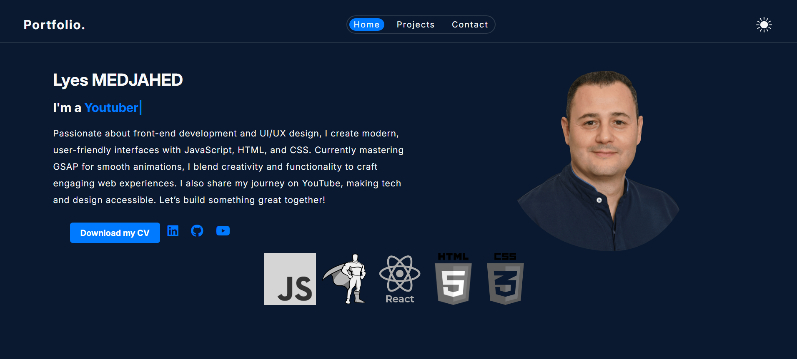

# Personal Portfolio  - < Lyes MEDJAHED />
My personal portfolio showcasing my work as a Frontend Developer, focused on modern web interfaces, clean design, and smooth animations.

## 🚀 Live Website
🔗 [https://lyesmedjahed.com](https://lyesmedjahed.github.io/portfolio/)

## 📸 Preview



## 👋 About Me
Hi, I’m Lyes, a Frontend Developer passionate about building modern, responsive, and user-friendly web applications.

I enjoy turning ideas into interactive experiences using modern JavaScript frameworks and animation libraries.

## 🛠️ Tech Stack


## ✨ Features
- Responsive and mobile-first design
- Smooth animations with GSAP
- Dark / Light theme support
- Dynamic content loading with modern JavaScript (async/await)
- Clean and modern UI
- Optimized performance
- Accessible and semantic HTML

## 💼 Open to Opportunities
I am currently open to junior frontend developer opportunities.

## 📫 Contact
- 📩Email: lyesmedjahed17@gmail.com  
- 🔗 LinkedIn: [Lyes Medjahed](https://linkedin.com/in/lyes-medjahed/)


## 📂 Installation & Setup
If you want to run this project locally:

```bash
git clone https://github.com/lyesmedjahed/portfolio/
cd PORTFOLIO_REPO
npm install
npm run dev

